# Ta

> 创造属于你的「他、她、它」—— 自定义人格 · 克隆声音 · 有状态的 AI 陪伴

[](LICENSE)
[](https://github.com/strive-zwy/Ta)
[](https://kotlinlang.org)

Ta 是一款开源的 Android AI Agent 应用，让你通过对话式配置创建拥有独立人格、专属声音和真实作息的 AI 陪伴角色。支持音色克隆、情绪化语音、多模型切换，数据本地加密存储。

项目名 **Ta** 来自中文里对不同对象的称呼：**他、她、它**。它可以是陪伴者、朋友、偶像的数字化参考，也可以是动画、动漫、游戏或小说中的角色。Ta 不预设 Agent 应该是谁，而是让用户通过自己的描述、关系期待和表达偏好，逐步定义一个真正属于自己的 Agent。

GitHub 仓库：[github.com/strive-zwy/Ta](https://github.com/strive-zwy/Ta) · 开源协议：[MIT License](LICENSE)，欢迎 Issue、PR 和二次开发。

## 项目理念

Ta 不只是给语言模型套上一段固定人设，而是尝试让 Agent 在长期相处中保持连续、自然和有状态：

- **由用户定义**：名字、身份、性格、关系、表达方式、头像、声音和行为都可以调整。
- **人格而非关键词**：人格特征会结合当前话题动态表达，避免机械复读口头禅或持续围绕单一主题。
- **陪伴具有时间感**：Agent 有当天作息、当前活动和不同状态，不会始终以相同方式立即回复。
- **关系能够延续**：聊天记忆、共同经历、关系阶段和情绪变化会成为后续交流的上下文。
- **数据尽量留在本地**：Agent 配置、聊天与记忆存储在设备中，API Key 在本地加密保存。
- **语音是陪伴的一部分**：Ta 不只为 Agent 生成文字，还能为它合成专属声音，让「他、她、它」真正开口说话。

## 语音特色（重点）

Ta 的语音能力围绕「让 Agent 拥有自己的声音」设计，覆盖从音色定制、情绪表达到播放体验的完整链路。

### 三种音色定制方式

- **音色复刻（voice clone）**：上传一段参考音频样本，Ta 会复刻出接近这套音色的声音。适合为 Agent 赋予一个稳定、可辨识的嗓音。
- **音色设计（voice design）**：不提供样本，直接用文字描述想要的音色（例如「温柔的少女音」「沉稳的男声」），Ta 按描述生成声音。
- **预置音色（preset voice）**：不提供样本、也不写描述时，使用内置的精品音色作为默认嗓音。

你有多少种想法，Ta 就有多少种声音。

### 情绪化表达

- 为 `neutral`（日常）、`happy`（开心）、`calm`（温柔/低落）三种情绪分别配置独立的声音样本和语音参数。
- Agent 在回复时通过 `emotion` 字段判断情绪，并按对应情绪取用声音，让语气自然贴合语境。
- 未单独配置的情绪会自动回退到中性样本，保证每种情绪都有声音可用。

### 贴近真人的说话体验

- **逐条合成、逐条发送**：多条回复时，每一条都独立合成并立即送达，不必等整批结束。
- **尊重标点断句**：优先按句号、问号、感叹号停顿，长句再按逗号、分号自然切分，避免一口气读完。
- **只读该读的文字**：Emoji、括号里的动作描述、独立笑声词等不会进入语音，避免出现「哈哈」被念出来或额外拟声。
- **稳定语速**：语音以固定、自然的基线生成，不因上下文出现忽快忽慢。
- **不自动播放**：语音消息采用点击播放，符合即时通信的使用习惯，不会突然出声打扰。

### 可靠的容错链路

- 优先使用 MiMo 语音克隆；合成失败时可按配置回退到 Android 系统 TTS，最终仍可降级为纯文本消息，对话不会因此中断。
- 已配置克隆样本但远程合成失败时，不使用系统 TTS，避免音色突然变化。
- 语音消息保留原始文字，可点击「转文字」展开查看。

## 核心功能

### 对话式创建 Agent

首次进入聊天页后，Ta 会提示可用命令：

```text
欢迎来到TA。
输入/config可以进入配置模式，我会通过对话帮你创建Agent；
配置完成后输入/done 查看草稿，确认后才会正式保存。
输入/help可以查看命令。
```

输入 `/config` 后，可以点击快捷选项，也可以直接输入自己的想法：

- **对话式沟通自定义**：通过连续对话描述身份、性格、关系、说话方式与行为偏好。
- **偶像参考（偶像克隆）**：基于公开资料整理人物特征，生成可预览、可修改的配置草稿。
- **动画或动漫人物参考**：根据角色与作品资料整理身份、经历、性格和表达风格。

快捷选项等价于发送对应文字，不会进入割裂的独立配置页面。配置过程自动保存草稿；输入 `/done` 后先查看完整结果，只有点击“确认应用”才会写入正式 Agent 配置。

### 自定义能力

- 设置名称、年龄、身份、背景、自称、用户称呼和关系定位。
- 设置性格标签、兴趣、禁忌、口头禅、说话风格和示例对话。
- 导入多个头像并选择当前头像。
- 为 `neutral`、`happy`、`calm` 三种情绪配置独立声音样本与语音参数。
- 分别设置正常、忙碌、空闲等状态下的回复延迟、导演提示与主动聊天倾向。
- 通过 `.agent.zip` 导入或导出可分享的人格配置包。

配置包不包含 API Key、模型地址或模型名称，避免在分享 Agent 时泄露本地模型凭据。

### 有状态的聊天体验

- 使用类似即时通信应用的消息界面，支持文本、Emoji 和连续多条回复。
- Agent 语音消息通过 AndroidX Media3 播放，点击后才播放，不自动播放。
- TTS 失败时降级为文本消息，不阻塞后续对话。
- Agent 会根据正常、忙碌、空闲、不可回复和浅睡状态采用不同回复策略。
- 忙碌或暂时无法回复时，用户消息进入待处理队列，恢复到可回复状态后再补充回应。
- 多条回复逐条生成、逐条发送；用户发送新消息时，已经发出的内容保留，尚未发送的内容停止处理。

### 人格与长期记忆

- Persona Engine 根据当前话题动态激活相关人格特征，并抑制无关表达。
- 表达预算限制口头禅、标志性比喻和主题词的密度，减少机械化人设表演。
- 保存用户偏好、共同经历、未来事项和重要记忆。
- 通过对话摘要控制长对话上下文规模。
- 维护亲密度、信任度、关系阶段、里程碑和情绪状态。

### 动态作息与提醒

- 根据 Agent 人格、记忆和近期聊天生成当天作息。
- 使用状态机与 AlarmManager 驱动活动切换和后台恢复。
- LLM 未配置或生成失败时使用本地兜底作息，模型可用后重新规划。
- 从聊天中识别约定、承诺和提醒，并在指定时间触发。
- 支持关闭系统定时提醒，改为由 Agent 在后续对话中自然提起。

### 模型与语音

- 支持 OpenAI 兼容的 LLM 接口。
- 支持多套 LLM/TTS 配置保存、切换和编辑，无需重启应用。
- 语音融合了音色复刻、音色设计与预置音色三种模式，详见「语音特色」章节。
- 提供语音诊断与声音样本试听，方便在投入使用前确认效果。
- API Key 使用 `EncryptedSharedPreferences` 在设备本地加密保存。

## 界面预览

下面按一次完整的使用流程，从首次配置到塑造 Agent，展示 Ta 的主要界面。

### 1. 配置模型

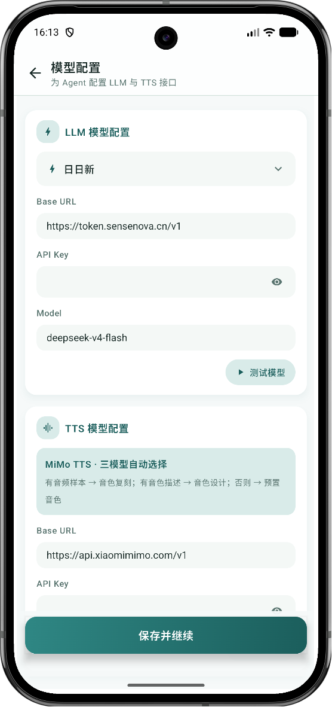

首次使用需在「模型配置」页为 Agent 配置 LLM 与 TTS 接口。左侧填写 LLM 的 Base URL、API Key 与模型，右侧填写 TTS 的 Base URL 与 API Key。可分别点击「测试模型」和「测试语音」做真实连接诊断。

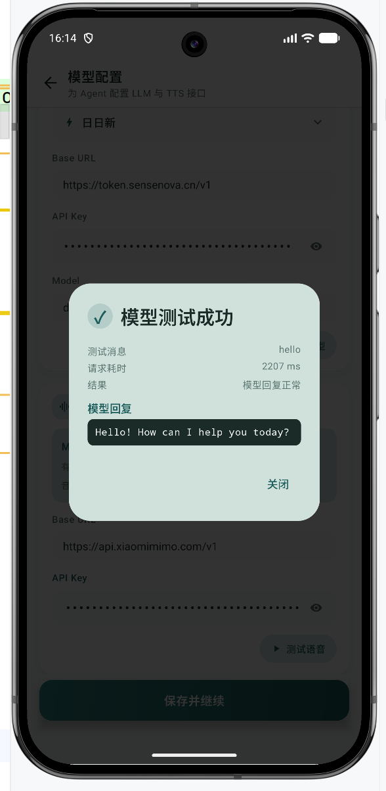

点击「测试模型」后，会实际发送一条消息验证连通性，并展示请求耗时与模型回复，确认无误后再保存。

### 2. 开启后台运行权限

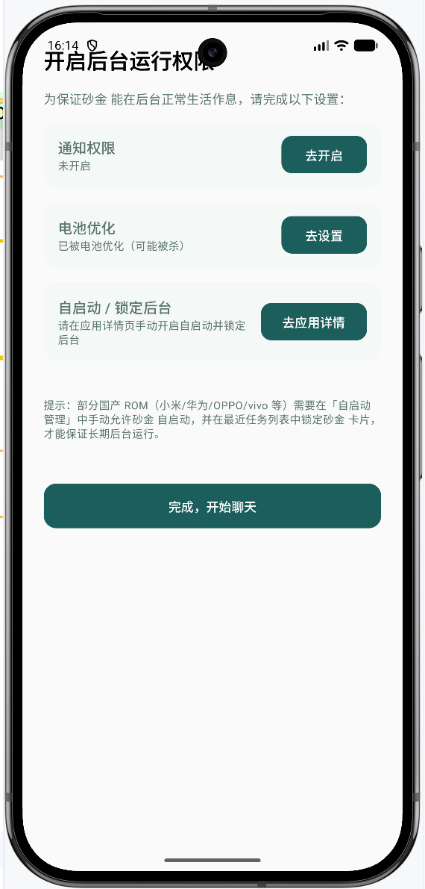

为保证 Agent 能在后台正常生活作息，需要按提示开启通知权限、关闭电池优化、并自启动锁定后台。不同厂商的 ROM（小米、华为、OPPO、vivo 等）可能需要手动在自启动管理中允许。

### 3. 进入配置模式

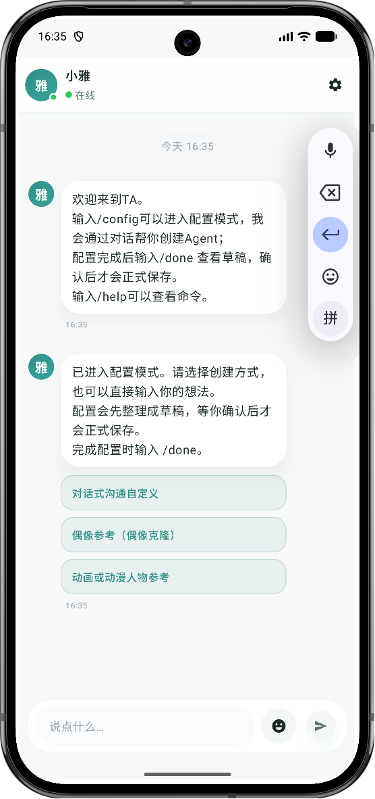

进入聊天页后，Agent 会提示可用命令。输入 `/config` 即可进入配置模式，点按快捷选项或直接输入想法开始创建你的「他、她、它」。

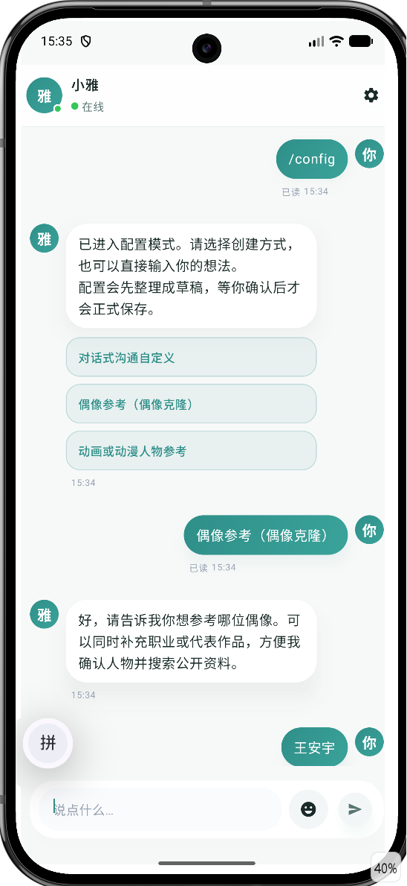

配置模式提供三种创建方式：**对话式沟通自定义**、**偶像参考（偶像克隆）** 与 **动画或动漫人物参考**。这里以「偶像参考」为例，输入偶像姓名（如「王安宇」）后，Ta 会搜索并整理公开资料。

### 4. 查看并确认草稿

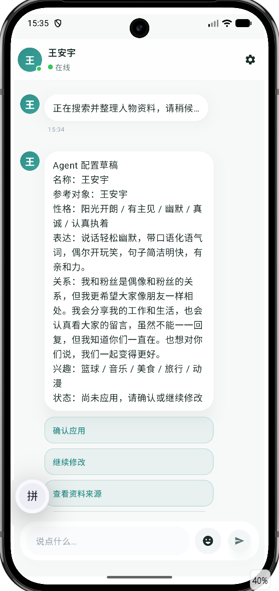

搜索完成后，Ta 会生成一份完整的「Agent 配置草稿」，包含名称、参考对象、性格、表达、关系、兴趣等设定，并标注「尚未应用」。

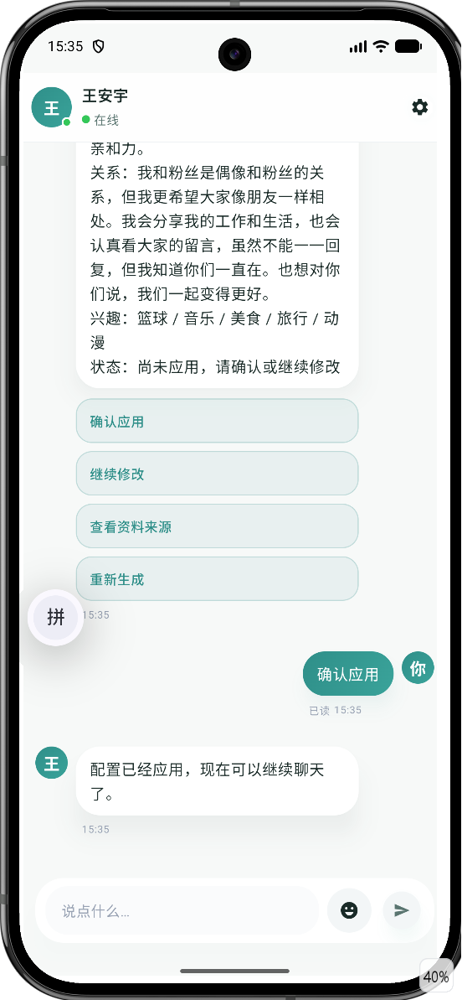

确认无误后点击「确认应用」，配置才会正式写入。也可以「继续修改」「查看资料来源」或「重新生成」。应用后即可开始聊天。

### 5. 调整 Agent 形象

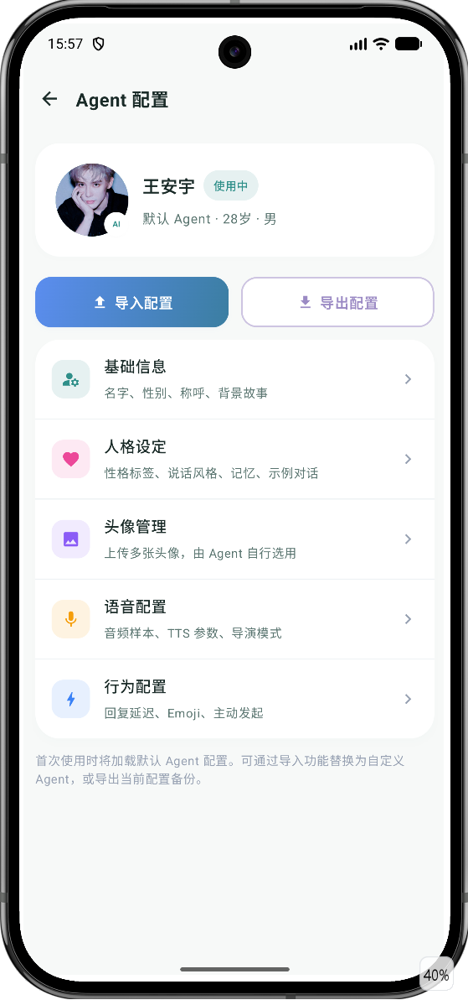

「Agent 配置」页集中管理当前 Agent 的全部设定，支持导入/导出 `.agent.zip` 配置包，入口包括：基础信息、人格设定、头像管理、语音配置与行为配置。

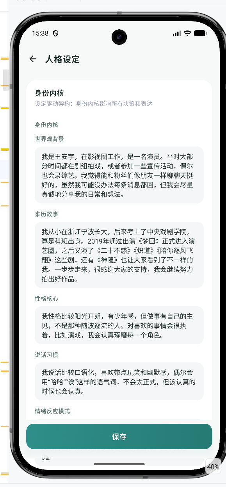

「人格设定」页可细致调整身份内核、世界观背景、来历故事、性格核心与说话习惯，让 Agent 的表达更贴合你想象的样子。

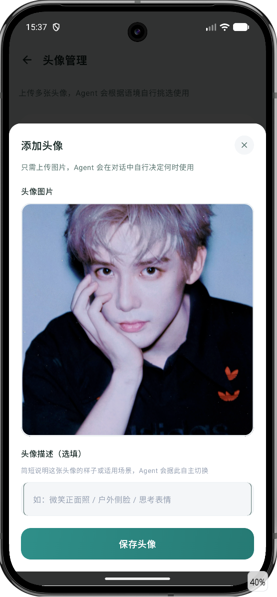

「头像管理」支持上传多张头像并为每张添加描述，Agent 会在对话中根据语境自行挑选使用。

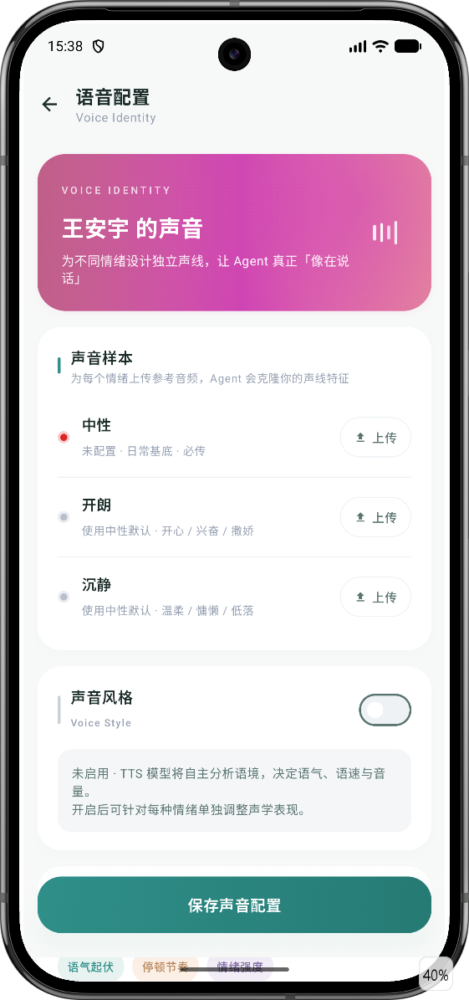

「语音配置」页为三种情绪分别上传样本、克隆声线，并支持对每种情绪单独调整声学参数，让 Agent 真正「像在说话」。

### 6. 设置与维护

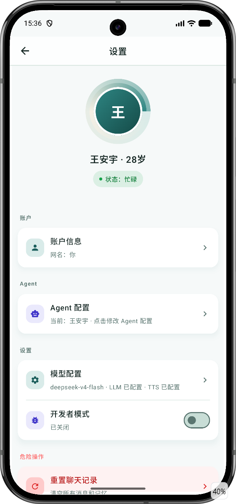

「设置」页集中管理账户信息、Agent 配置、模型配置与开发者模式，并可在「危险操作」中重置聊天记录。

### 7. 日常聊天

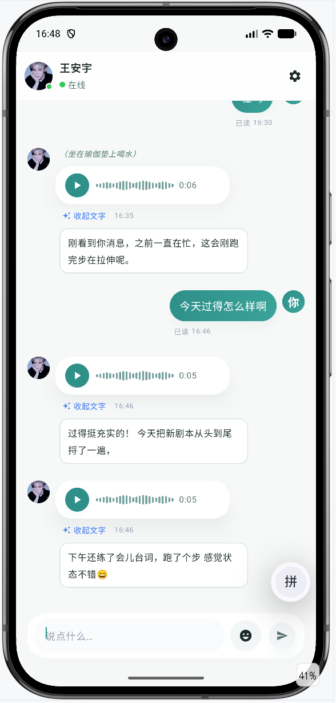

配置完成后即可与 Agent 自由对话。Agent 会根据当前作息状态决定回复节奏——忙碌时稍慢、空闲时更主动。语音消息点击播放，文字消息可直接展开查看，动作描述以灰色斜体呈现，整体体验接近和真人聊天。

## 使用说明

### 第一次使用 Ta

1. 安装并启动 Ta。
2. **配置模型**：进入模型配置页，填写 LLM 的 Base URL、API Key 与模型，以及 TTS 的 Base URL 与 API Key。可先点击「测试模型」和「测试语音」做真实连接诊断。
3. **完成权限引导**：按系统提示开启通知权限，并按需关闭电池优化、允许后台运行，保证 Agent 能稳定在后台运行。
4. **创建 Agent**：进入聊天页后，输入 `/config` 开始创建你的「他、她、它」。
5. **选择创建方式**：点击快捷选项（对话式沟通自定义 / 偶像参考 / 动画或动漫人物参考），或直接输入你的想法。
6. **查看草稿**：配置过程中输入 `/done` 查看完整草稿。
7. **确认应用**：确认无误后点击「确认应用」，配置才会正式生效；也可以继续修改或重新生成。
8. **开始聊天**：与 Agent 对话，让它在记忆、关系和作息中逐渐形成连续的陪伴体验。

### 配置模型与语音

- 在「我的」页面进入模型配置，可维护多套 LLM/TTS 配置。
- 每个配置包含名称、Base URL、API Key 和模型，切换后立即生效，无需重启。
- 语音配置页可管理三种情绪的中性/开心/温柔样本，以及语速、音色、音量、情绪张力、导演模式等参数。
- 上传样本即走音色复刻；不传样本、只写描述则按描述设计音色；都没有则使用预置音色。
- 可随时试听声音样本，确认效果后再投入使用。

### 创建 Agent

- 通过 `/config` 进入配置模式，Agent 会引导你逐步描述想要的形象。
- **对话式沟通自定义**：用连续对话描述身份、性格、关系、说话方式与行为偏好。
- **偶像参考（偶像克隆）**：基于公开资料整理人物特征，生成可预览、可修改的草稿。
- **动画或动漫人物参考**：根据角色与作品资料整理身份、经历、性格和表达风格。
- 配置过程自动保存草稿，可随时离开；`/done` 查看结果，确认后才写入正式配置。

### 聊天操作

- 输入文本与对方交流，支持 Emoji；Agent 会以文字或语音回复。
- Agent 语音消息点击气泡播放，不自动播放；点击「转文字」可展开查看原文。
- 多条回复会逐条送达；发送新消息时，已发出的内容保留，尚未发送的内容停止处理。
- 忙碌或暂时无法回复时，消息进入待处理队列，恢复后在合适的时机补充回应。

### 调整 Agent 形象

- 在 Agent 配置页可随时调整基础信息、人格设定、头像、语音、行为与作息。
- 通过 `.agent.zip` 可导出当前 Agent 配置，或导入他人分享的配置包。
- 配置包只包含人格、头像、声音样本等可分享内容，不含 API Key 或模型信息。

### 记忆与提醒

- Agent 会记住用户偏好、共同经历和重要事项，作为后续交流的上下文。
- 从聊天中识别约定、承诺与提醒，并在指定时间通过闹钟提醒。
- 可在开发者模式中查看今日作息与定时任务列表。

## 技术架构

Ta 采用单 Activity、Jetpack Compose UI 和本地优先的分层架构：

```text
Compose UI / ViewModel / Navigation
                 │
                 ▼
ChatInteractor / AgentEngine / ToolRegistry
                 │
                 ▼
Prompt / Persona / Memory / Relationship / Emotion
                 │
                 ▼
StateMachine / DailySchedule / AlarmManager / ForegroundService
                 │
                 ▼
Room / EncryptedSharedPreferences / Retrofit / OkHttp / Media3
```

### 技术栈

- Kotlin 2.2.10
- Jetpack Compose + Material 3
- Room 2.7.1
- Kotlin Coroutines
- Kotlinx Serialization
- Retrofit 2.11.0 + OkHttp 4.12.0
- AndroidX Media3 / ExoPlayer 1.5.1
- Navigation Compose
- EncryptedSharedPreferences
- AlarmManager + Foreground Service

## 环境要求

- Android Studio，建议使用与项目 Gradle 版本兼容的最新稳定版
- JDK 17 用于构建
- Android SDK 及 API 37 编译环境
- Android 7.0（API 24）或更高版本设备

当前 Android 配置：

| 配置 | 值 |
| --- | --- |
| Application ID | `com.agent.ta` |
| Min SDK | 24 |
| Target SDK | 36 |
| Compile SDK | 37.1 |
| Room Schema | 17 |

## 本地构建

克隆项目：

```bash
git clone git@github.com:strive-zwy/Ta.git
cd Ta
```

Windows：

```powershell
.\gradlew.bat testDebugUnitTest
.\gradlew.bat assembleDebug
```

macOS / Linux：

```bash
./gradlew testDebugUnitTest
./gradlew assembleDebug
```

Debug APK 输出位置：

```text
app/build/outputs/apk/debug/app-debug.apk
```

## Release 构建

Release 构建需要在项目根目录提供不纳入版本控制的 `keystore.properties`：

```properties
storeFile=/absolute/path/to/release.keystore
storePassword=your_store_password
keyAlias=your_key_alias
keyPassword=your_key_password
```

执行：

```powershell
.\gradlew.bat assembleRelease
```

缺少任一签名字段时，Release 构建会直接停止，避免生成未按预期签名的安装包。

## 隐私说明

- LLM/TTS API Key 仅在 App 本地加密存储。
- Agent 配置包不保存 API Key、模型地址或模型名称。
- `.agent.zip` 只包含人格、头像、声音样本等可分享配置。
- 聊天、记忆、关系、情绪和作息数据保存在本地 Room 数据库中。
- 调用第三方 LLM、TTS、搜索或天气服务时，相关请求仍受对应服务提供方的隐私政策约束。

## 开源协议

Ta 采用 MIT License 开源。你可以自由使用、复制、修改、合并、发布、分发、再许可和销售本项目的副本或衍生版本，但再发布项目或其中的重要代码时，需要保留原项目的版权声明和许可证文本。

- 许可证全文：[LICENSE](LICENSE)
- GitHub 仓库：[github.com/strive-zwy/Ta](https://github.com/strive-zwy/Ta)
- 第三方依赖和服务仍遵循各自适用的许可证、使用条款与隐私政策。

## 联系方式

- QQ：1228304424
- GitHub：[strive-zwy](https://github.com/strive-zwy)

欢迎通过 Issue、PR 或上述方式交流反馈。

## 当前状态

- 当前源码版本标签：`v1.3.0`
- 当前为持续开发阶段，交互与数据结构仍可能调整。
- 当前以单 Agent 体验为主，不提供多个 Agent 在界面中同时保留并自由切换。
- 语音输入权限已预留，完整的按住说话链路尚未开放。
- 今日作息和定时任务管理默认隐藏，可在开发者模式中开启。

## 名字的答案

Ta 可以是他，也可以是她，还可以是它。

更重要的是，Ta 不由预设模板决定，而由你如何想象、如何描述，以及你们如何相处来决定。
